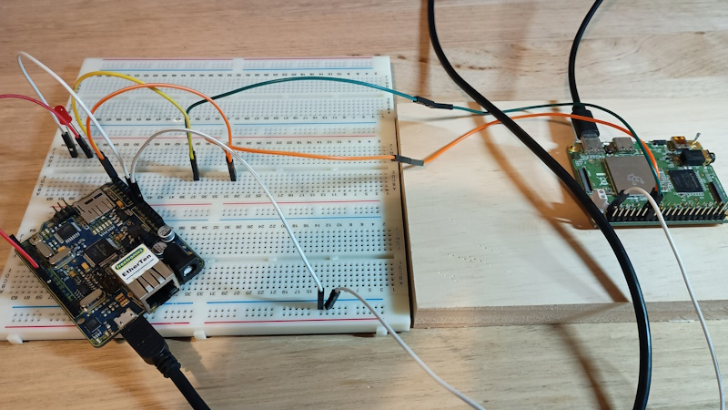

# Coral Dev Mini Setup and I2C #

This is a rough guide on setting up the Coral Dev Mini to run a cross compiled app and send i2c msgs to an arduino to blink an LED.



### Hardware Used ###
* Coral Dev Mini
* Arduino
* Ubuntu Machine

### Cross compile instructions from Cmake ### 
https://cmake.org/cmake/help/book/mastering-cmake/chapter/Cross%20Compiling%20With%20CMake.html
* The name of the target operating system
   * ```set(CMAKE_SYSTEM_NAME Windows)```

* Which compilers to use for C and C++
   * ```set(CMAKE_C_COMPILER   i586-mingw32msvc-gcc)```
   * ```set(CMAKE_CXX_COMPILER i586-mingw32msvc-g++)```

* Where is the target environment located
   * ```set(CMAKE_FIND_ROOT_PATH  /path/to/buildroot/rootfs)```

* Adjust the default behavior of the FIND_XXX() commands. Search programs in the host environment.
   * ```set(CMAKE_FIND_ROOT_PATH_MODE_PROGRAM NEVER)```

* Search headers and libraries in the target environment
   * ```set(CMAKE_FIND_ROOT_PATH_MODE_LIBRARY ONLY)```
   * ```set(CMAKE_FIND_ROOT_PATH_MODE_INCLUDE ONLY)```

* Then
   * ```~/src$ cd build```
   * ```~/src/build$ cmake -DCMAKE_TOOLCHAIN_FILE=~/TC-mingw.cmake ..```
   * ```...then build ```

### Instructions to build for my use case ### 
* Download arm toolkit. The correct version is needed to match with the coral firmware.
* https://developer.arm.com/-/media/Files/downloads/gnu-a/8.3-2019.03/binrel/gcc-arm-8.3-2019.03-x86_64-aarch64-linux-gnu.tar.xz?revision=2e88a73f-d233-4f96-b1f4-d8b36e9bb0b9&rev=2e88a73fd2334f96b1f4d8b36e9bb0b9&hash=0C1205BC354077066DB91E85A62482DFE806798F

* (optional) Compile firmware
   * This part wasn't smooth. It required updating some dead links as the build progressed
   * Check out repo and build. https://coral.googlesource.com/docs/+/refs/heads/master/GettingStarted.md
https://developer.ridgerun.com/wiki/index.php/Coral_from_Google/Camera_Drivers/How_to_recompile_kernel
Be sure to shutdown the board correctly to put into bootloader mode before flashing. ```sudo reboot-bootloader```
The buildroot output can be used for cross compilation later

* Build
   * ```mkdir build```
   * ```cd build```
   * ```cmake```
   * ```make```

* Prepare
   * Copy file over with ```mdt push test_app```
   * Compile info can be checked with ```file test_app```
   * On the board ```"chmod +x ./test_app"```

### Arduino ### 
* Compile the attached sketch and wire up as pictured

### To Run ###
* Run the arduino sketch
* Run the app on the coral dev board
* The LED should start blinking 

### Debugging ###
* Use ```i2cdetect -y 0``` from the coral to see the arduino
* Use ```i2cset 0x09 0x33``` from the coral to trigger the arduino to blink the LED

### Helpful links ### 
* https://coral.ai/docs/dev-board-mini/get-started/
* https://coral.ai/docs/dev-board-mini/serial-console/
* https://coral.ai/docs/notes/build-coral/
* https://coral.ai/docs/dev-board/mdt/
* https://coral.ai/docs/dev-board/reflash/
